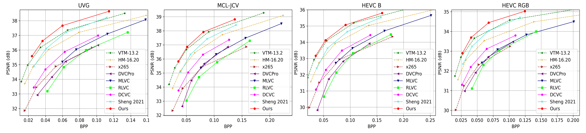

# Introduction

Official Pytorch implementation for [Hybrid Spatial-Temporal Entropy Modelling for Neural Video Compression](https://arxiv.org/abs/2207.05894), in ACM MM 2022.

# Prerequisites
* Python 3.8 and conda, get [Conda](https://www.anaconda.com/)
* CUDA if want to use GPU
* Environment
    ```
    conda create -n $YOUR_PY38_ENV_NAME python=3.8
    conda activate $YOUR_PY38_ENV_NAME

    conda install pytorch==1.11.0 torchvision==0.12.0 torchaudio==0.11.0 cudatoolkit=11.3 -c pytorch
    pip install -r requirements.txt
    ```

# Test dataset
We support arbitrary original resolution. The input video resolution will be padded to 64x automatically. The reconstructed video will be cropped back to the original size. The distortion (PSNR/MS-SSIM) is calculated at original resolution.

The dataset format can be seen in dataset_config_example.json.

For example, one video of HEVC Class B can be prepared as:
* Make the video path:
    ```
    mkdir BasketballDrive_1920x1080_50
    ```
* Convert YUV to PNG:
    ```
    ffmpeg -pix_fmt yuv420p -s 1920x1080 -i BasketballDrive_1920x1080_50.yuv -f image2 BasketballDrive_1920x1080_50/im%05d.png
    ```
At last, the folder structure of dataset is like:

    /media/data/HEVC_B/
        * BQTerrace_1920x1080_60/
            - im00001.png
            - im00002.png
            - im00003.png
            - ...
        * BasketballDrive_1920x1080_50/
            - im00001.png
            - im00002.png
            - im00003.png
            - ...
        * ...
    /media/data/HEVC_D
    /media/data/HEVC_C/
    ...

# Build the project
Please build the C++ code if want to test with actual bitstream writing. There is minor difference about the bits for calculating the bits using entropy (the method used in the paper to report numbers) and actual bitstreaming writing. There is overhead when writing the bitstream into the file and the difference percentage depends on the bitstream size. Usually, the overhead for 1080p content is less than 0.5%.
## On Windows
```bash
cd src
mkdir build
cd build
conda activate $YOUR_PY38_ENV_NAME
cmake ../cpp -G "Visual Studio 16 2019" -A x64
cmake --build . --config Release
```

## On Linux
```bash
sudo apt-get install cmake g++
cd src
mkdir build
cd build
conda activate $YOUR_PY38_ENV_NAME
cmake ../cpp -DCMAKE_BUILD_TYPE=Release
make -j
```

# Pretrained models

* Download [Our pretrained models](https://1drv.ms/u/s!AozfVVwtWWYoiUAGk6xr-oELbodn?e=kry2Nk) and put them into ./checkpoints folder.
* Or run the script in ./checkpoints directly to download the model.
# Test the models

Example to test pretrained model with four rate points:
```bash
python test_video.py --i_frame_model_path ./checkpoints/acmmm2022_image_psnr.pth.tar --model_path ./checkpoints/acmmm2022_video_psnr.pth.tar --rate_num 4 --test_config ./dataset_config_example.json --cuda 1 -w 1 --write_stream 0 --output_path output.json --force_intra_period 32 --force_frame_num 96
```
It is recommended that the ```--worker``` number is equal to your GPU number.

You can also specify different q_scales values to test other bitrate points. It is suggested to change all the three q_scales together and generate the interpolated q_scales between the minimum one and maximum one.
For examples, using intra_q_scales = scale_list_to_str(interpolate_log(minimum_value, maximum_value, number_of_rate_points))
Please use --rate_num to specify the rate number and --i_frame_q_scales, --p_frame_mv_y_q_scales, --p_frame_y_q_scales to specify the q_scales.
Please note that, using q_scales out of the range [minimum_value, maximum_value] has not been tested and may generate poor encoding results.


# R-D Curves


# Acknowledgement
The implementation is based on [CompressAI](https://github.com/InterDigitalInc/CompressAI) and [PyTorchVideoCompression](https://github.com/ZhihaoHu/PyTorchVideoCompression).
# Citation
If you find this work useful for your research, please cite:

```
@inproceedings{li2022hybrid,
  title={Hybrid Spatial-Temporal Entropy Modelling for Neural Video Compression},
  author={Li, Jiahao and Li, Bin and Lu, Yan},
  booktitle={Proceedings of the 30th ACM International Conference on Multimedia},
  year={2022}
}
```

# Trademarks
This project may contain trademarks or logos for projects, products, or services. Authorized use of Microsoft trademarks or logos is subject to and must follow [Microsoft’s Trademark & Brand Guidelines](https://www.microsoft.com/en-us/legal/intellectualproperty/trademarks/usage/general). Use of Microsoft trademarks or logos in modified versions of this project must not cause confusion or imply Microsoft sponsorship. Any use of third-party trademarks or logos are subject to those third-party’s policies.
