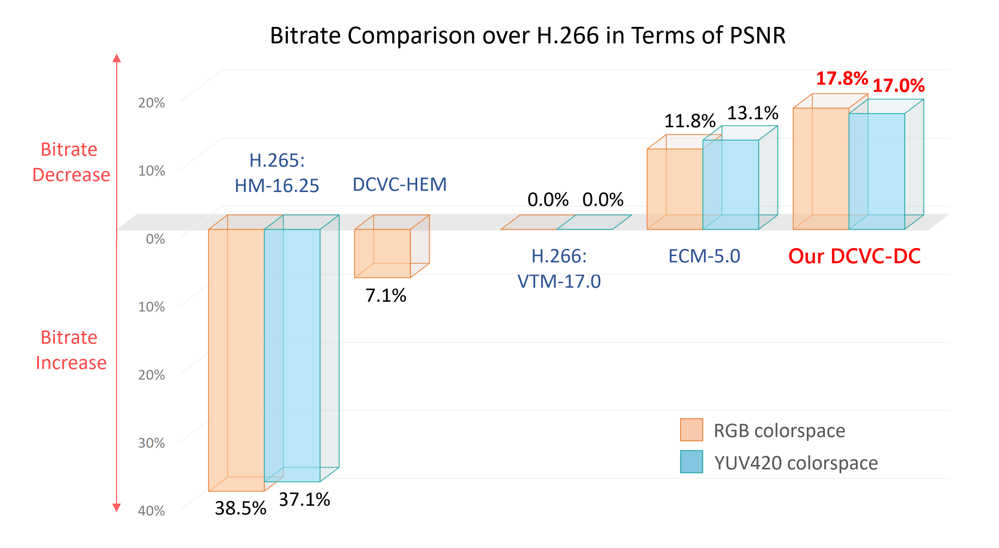
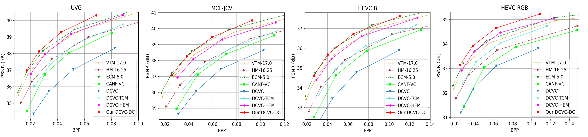
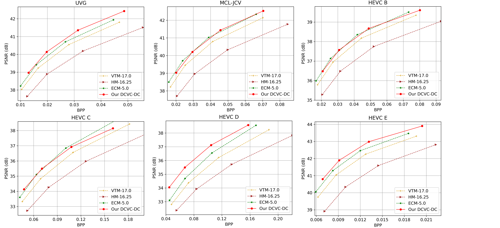

# Introduction

Official Pytorch implementation for DCVC-DC: [Neural Video Compression with **D**iverse **C**ontexts](https://arxiv.org/abs/2302.14402), in CVPR 2023.

# Prerequisites
* Python 3.8 and conda, get [Conda](https://www.anaconda.com/)
* CUDA if want to use GPU
* Environment
    ```
    conda create -n $YOUR_PY38_ENV_NAME python=3.8
    conda activate $YOUR_PY38_ENV_NAME

    conda install pytorch==1.11.0 torchvision==0.12.0 torchaudio==0.11.0 cudatoolkit=11.3 -c pytorch
    pip install -r requirements.txt
    ```

* Environment if using XPU (Intel GPU)
   ```
   python -m pip install torch==2.1.0a0 torchvision==0.16.0a0 torchaudio==2.1.0a0 intel-extension-for-pytorch==2.1.10+xpu \
     --extra-index-url https://pytorch-extension.intel.com/release-whl/stable/xpu/us/
   pip install -r requirements.txt
   ```

# Test dataset

We support arbitrary original resolution. The input video resolution will be padded to 64x automatically. The reconstructed video will be cropped back to the original size. The distortion (PSNR/MS-SSIM) is calculated at original resolution.

## YUV 420 content

Put the*.yuv in the folder structure similar to the following structure.

    /media/data/HEVC_B/
        - BQTerrace_1920x1080_60.yuv
        - BasketballDrive_1920x1080_50.yuv
        - ...
    /media/data/HEVC_D/
    /media/data/HEVC_C/
    ...

The dataset structure can be seen in dataset_config_example_yuv420.json.

## RGB content

Please convert YUV 420 data to RGB data using BT.709 conversion matrix.

For example, one video of HEVC Class B can be prepared as:
* Make the video path:
    ```
    mkdir BasketballDrive_1920x1080_50
    ```
* Convert YUV to PNG:

We use BT.709 conversion matrix to generate png data to test RGB sequences. Please refer to ./test_data_to_png.py for more details.

At last, the folder structure of dataset is like:

    /media/data/HEVC_B/
        * BQTerrace_1920x1080_60/
            - im00001.png
            - im00002.png
            - im00003.png
            - ...
        * BasketballDrive_1920x1080_50/
            - im00001.png
            - im00002.png
            - im00003.png
            - ...
        * ...
    /media/data/HEVC_D/
    /media/data/HEVC_C/
    ...

The dataset structure can be seen in dataset_config_example_rgb.json.

# Build the project
Please build the C++ code if want to test with actual bitstream writing. There is minor difference about the bits for calculating the bits using entropy (the method used in the paper to report numbers) and actual bitstreaming writing. There is overhead when writing the bitstream into the file and the difference percentage depends on the bitstream size. Usually, the overhead for 1080p content is less than 0.5%.
## On Windows
```bash
cd src
mkdir build
cd build
conda activate $YOUR_PY38_ENV_NAME
cmake ../cpp -G "Visual Studio 16 2019" -A x64
cmake --build . --config Release
```

## On Linux
```bash
sudo apt-get install cmake g++
cd src
mkdir build
cd build
conda activate $YOUR_PY38_ENV_NAME
cmake ../cpp -DCMAKE_BUILD_TYPE=Release
make -j
```

# Pretrained models

* Download [Our pretrained models](https://1drv.ms/u/s!AozfVVwtWWYoiWdwDhEkZMIfpon5?e=JcGri5) and put them into ./checkpoints folder.
* Or run the script in ./checkpoints directly to download the model.
* There are 6 models:
  * \*image\* are image models and \*video\* are video models.
  * \*psnr\* are models optimized for PSNR, \*ssim\* are models optimized for MS-SSIM, \*yuv420_psnr\* are models optimized for PSNR of YUV420 content.

# Test the models

Example to test pretrained model with four rate points:
```bash
python test_video.py --i_frame_model_path ./checkpoints/cvpr2023_image_psnr.pth.tar --p_frame_model_path ./checkpoints/cvpr2023_video_psnr.pth.tar --rate_num 4 --test_config ./dataset_config_example_rgb.json --yuv420 0 --cuda 1 --worker 1 --write_stream 0 --output_path output.json --force_intra_period 32 --force_frame_num 96
```
When testing YUV 420 content, please change the model path, test configuration json file and specify ```--yuv420 1``` in the command line.

It is recommended that the ```--worker``` number is equal to your GPU number.

You can also specify different ```--rate_num``` values (2~64) to test finer bitrate adjustment.

# Comparing with other method
Bit saving over VTM-17.0



RD curve of RGB PNSR



RD curve of YUV420 PSNR



# Acknowledgement
The implementation is based on [CompressAI](https://github.com/InterDigitalInc/CompressAI) and [PyTorchVideoCompression](https://github.com/ZhihaoHu/PyTorchVideoCompression).
# Citation
If you find this work useful for your research, please cite:

```
@inproceedings{li2023neural,
  title={Neural Video Compression with Diverse Contexts},
  author={Li, Jiahao and Li, Bin and Lu, Yan},
  booktitle={{IEEE/CVF} Conference on Computer Vision and Pattern Recognition,
             {CVPR} 2023, Vancouver, Canada, June 18-22, 2023},
  year={2023}
}
```

# Trademarks
This project may contain trademarks or logos for projects, products, or services. Authorized use of Microsoft trademarks or logos is subject to and must follow [Microsoft’s Trademark & Brand Guidelines](https://www.microsoft.com/en-us/legal/intellectualproperty/trademarks/usage/general). Use of Microsoft trademarks or logos in modified versions of this project must not cause confusion or imply Microsoft sponsorship. Any use of third-party trademarks or logos are subject to those third-party’s policies.
