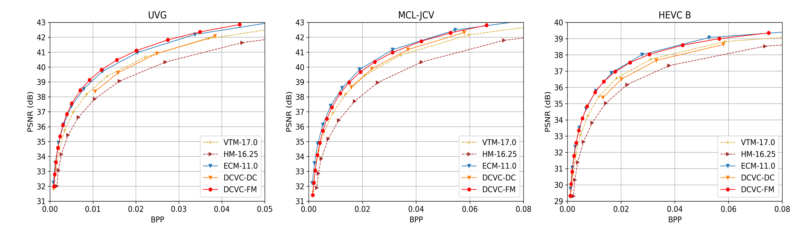

# Introduction

Official Pytorch implementation for DCVC-FM: [Neural Video Compression with **F**eature **M**odulation](https://arxiv.org/abs/2402.17414), in CVPR 2024.

# Prerequisites
* Python 3.10 and conda, get [Conda](https://www.anaconda.com/)
* CUDA if want to use GPU
* Environment
    ```
    conda create -n $YOUR_PY_ENV_NAME python=3.10
    conda activate $YOUR_PY_ENV_NAME

    conda install pytorch==2.0.0 torchvision==0.15.0 torchaudio==2.0.0 pytorch-cuda=11.8 -c pytorch -c nvidia
    pip install -r requirements.txt
    ```

# Test dataset

We support arbitrary original resolution. The input video resolution will be padded automatically. The reconstructed video will be cropped back to the original size. The distortion (PSNR) is calculated at original resolution.

## YUV 420 content

Put the*.yuv in the folder structure similar to the following structure.

    /media/data/HEVC_B/
        - BQTerrace_1920x1080_60.yuv
        - BasketballDrive_1920x1080_50.yuv
        - ...
    /media/data/HEVC_D/
    /media/data/HEVC_C/
    ...

The dataset structure can be seen in dataset_config_example_yuv420.json.

## RGB content

Please convert YUV 420 data to RGB data using BT.709 conversion matrix.

For example, one video of HEVC Class B can be prepared as:
* Make the video path:
    ```
    mkdir BasketballDrive_1920x1080_50
    ```
* Convert YUV to PNG:

We use BT.709 conversion matrix to generate png data to test RGB sequences. Please refer to ./test_data_to_png.py for more details.

At last, the folder structure of dataset is like:

    /media/data/HEVC_B/
        * BQTerrace_1920x1080_60/
            - im00001.png
            - im00002.png
            - im00003.png
            - ...
        * BasketballDrive_1920x1080_50/
            - im00001.png
            - im00002.png
            - im00003.png
            - ...
        * ...
    /media/data/HEVC_D/
    /media/data/HEVC_C/
    ...

The dataset structure can be seen in dataset_config_example_rgb.json.

# Build the project
Please build the C++ code if want to test with actual bitstream writing. There is minor difference about the bits for calculating the bits using entropy (the method used in the paper to report numbers) and actual bitstreaming writing. There is overhead when writing the bitstream into the file and the difference percentage depends on the bitstream size.

## Build the entropy encoding/decoding module
```bash
sudo apt-get install cmake g++
cd src
mkdir build
cd build
conda activate $YOUR_PY_ENV_NAME
cmake ../cpp -DCMAKE_BUILD_TYPE=Release
make -j
```

## Build customized flow warp implementation (especially you want to test fp16 inference)
```
sudo apt install ninja-build
cd ./src/models/extensions/
python setup.py build_ext --inplace
```

# Pretrained models

* Download [our pretrained models](https://1drv.ms/f/s!AozfVVwtWWYoi1QkAhlIE-7aAaKV?e=OoemTr) and put them into ./checkpoints folder.
* Or run the script in ./checkpoints directly to download the model.
* There are 2 models, one for image coding and the other for video coding.

# Test the models

Example to test pretrained model with four rate points:
```bash
python test_video.py --model_path_i ./checkpoints/cvpr2024_image.pth.tar --model_path_p ./checkpoints/cvpr2024_video.pth.tar --rate_num 4 --test_config ./dataset_config_example_yuv420.json --cuda 1 --worker 1 --write_stream 0 --output_path output.json --force_intra_period 9999 --force_frame_num 96
```

It is recommended that the ```--worker``` number is equal to your GPU number.

You can also specify different ```--rate_num``` values (2~64) to test finer bitrate adjustment.

# Comparing with other method
Bit saving over VTM-17.0 (HEVC E (600 frames) with single intra-frame setting (i.e. intra-period = –1) and YUV420 colorspace.)


RD curve of YUV420 PSNR



# Acknowledgement
The implementation is based on [CompressAI](https://github.com/InterDigitalInc/CompressAI) and [PyTorchVideoCompression](https://github.com/ZhihaoHu/PyTorchVideoCompression).
# Citation
If you find this work useful for your research, please cite:

```
@inproceedings{li2024neural,
  title={Neural Video Compression with Feature Modulation},
  author={Li, Jiahao and Li, Bin and Lu, Yan},
  booktitle={{IEEE/CVF} Conference on Computer Vision and Pattern Recognition,
             {CVPR} 2024, Seattle, WA, USA, June 17-21, 2024},
  year={2024}
}
```

# Trademarks
This project may contain trademarks or logos for projects, products, or services. Authorized use of Microsoft trademarks or logos is subject to and must follow [Microsoft’s Trademark & Brand Guidelines](https://www.microsoft.com/en-us/legal/intellectualproperty/trademarks/usage/general). Use of Microsoft trademarks or logos in modified versions of this project must not cause confusion or imply Microsoft sponsorship. Any use of third-party trademarks or logos are subject to those third-party’s policies.
