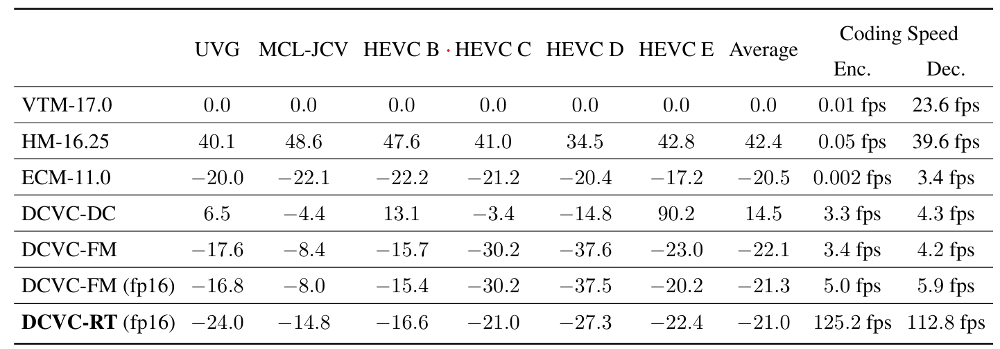

# Introduction

Official Pytorch implementation for DCVC-RT: [Towards Practical **R**eal-**T**ime Neural Video Compression](https://arxiv.org/abs/2502.20762), in CVPR 2025.

# Prerequisites
* Python 3.12 and conda, get [Conda](https://www.anaconda.com/)
* CUDA 12.6 (other versions may also work. Make sure the CUDA version matches with pytorch.)
* pytorch (We have tested that pytorch-2.6 works. Other versions may also work.)
* Environment
    ```
    conda create -n $YOUR_PY_ENV_NAME python=3.12
    conda activate $YOUR_PY_ENV_NAME

    pip install torch torchvision torchaudio --index-url https://download.pytorch.org/whl/cu126
    pip install -r requirements.txt
    ```

# Test dataset

We support arbitrary original resolution. The input video resolution will be padded automatically. The reconstructed video will be cropped back to the original size. The distortion (PSNR) is calculated at original resolution.

## YUV 420 content

Put *.yuv in the folder structure similar to the following structure.

    /media/data/HEVC_B/
        - BQTerrace_1920x1080_60.yuv
        - BasketballDrive_1920x1080_50.yuv
        - ...
    /media/data/HEVC_D/
    /media/data/HEVC_C/
    ...

The dataset structure can be seen in dataset_config_example_yuv420.json.

## RGB content

We highly suggest testing YUV420 content. To test RGB content, please refer to the [DCVC-FM](../DCVC-FM) folder.

# Build the project
Please build the C++ code to support bitstream writing and customized CUDA kernels to fuse operations.

```bash
sudo apt-get install cmake g++ ninja-build
conda activate $YOUR_PY_ENV_NAME
cd ./src/cpp/
pip install .
cd ../layers/extensions/inference/
pip install .
```

# CPU performance scaling

Note that the arithmetic coding runs on the CPU, please make sure your CPU runs at high performance while writing the actual bitstream. Otherwise, the arithmetic coding may take a long time.

Check the CPU frequency by
```
grep -E '^model name|^cpu MHz' /proc/cpuinfo
```

Run the following command to maximum CPU frequency
```
echo performance | sudo tee /sys/devices/system/cpu/cpu*/cpufreq/scaling_governor
```

Run the following command to recover the default frequency
```
echo ondemand | sudo tee /sys/devices/system/cpu/cpu*/cpufreq/scaling_governor
```

# Pretrained models

* Download [our pretrained models](https://1drv.ms/f/c/2866592d5c55df8c/Esu0KJ-I2kxCjEP565ARx_YB88i0UnR6XnODqFcvZs4LcA?e=by8CO8) and put them into ./checkpoints folder.
* There are 2 models, one for image coding and the other for video coding.

# Test the models

Example to test pretrained model with four rate points:
```bash
 python test_video.py --model_path_i ./checkpoints/cvpr2025_image.pth.tar --model_path_p ./checkpoints/cvpr2025_video.pth.tar --rate_num 4 --test_config ./dataset_config_example_yuv420.json --cuda 1 -w 1 --write_stream 1 --force_zero_thres 0.12 --output_path output.json --force_intra_period -1 --reset_interval 64 --force_frame_num -1 --check_existing 0
```

It is recommended that the ```-w``` number is equal to your GPU number.

You can also specify different ```--rate_num``` values (2~64) to test finer bitrate adjustment.

# Comparing with other method
Bit saving over VTM-17.0 (UVG all frames with single intra-frame setting (i.e. intra-period = –1) and YUV420 colorspace.)


The BD-Rate and encoding/decoding speed on Nvidia A100 GPU



# Acknowledgement
The implementation is based on [CompressAI](https://github.com/InterDigitalInc/CompressAI).

# Citation
If you find this work useful for your research, please cite:

```
@inproceedings{jia2025towards,
  title={Towards Practical Real-Time Neural Video Compression},
  author={Jia, Zhaoyang and Li, Bin and Li, Jiahao and Xie, Wenxuan and Qi, Linfeng and Li, Houqiang and Lu, Yan},
  booktitle={{IEEE/CVF} Conference on Computer Vision and Pattern Recognition,
             {CVPR} 2025, Nashville, TN, USA, June 11-25, 2024},
  year={2025}
}
```

# Trademarks
This project may contain trademarks or logos for projects, products, or services. Authorized use of Microsoft trademarks or logos is subject to and must follow [Microsoft’s Trademark & Brand Guidelines](https://www.microsoft.com/en-us/legal/intellectualproperty/trademarks/usage/general). Use of Microsoft trademarks or logos in modified versions of this project must not cause confusion or imply Microsoft sponsorship. Any use of third-party trademarks or logos are subject to those third-party’s policies.