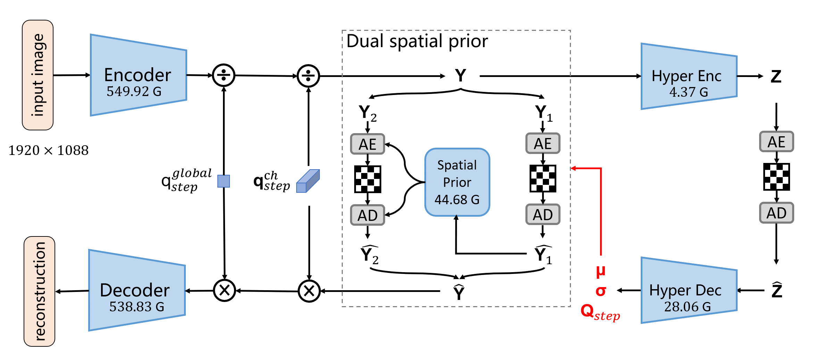
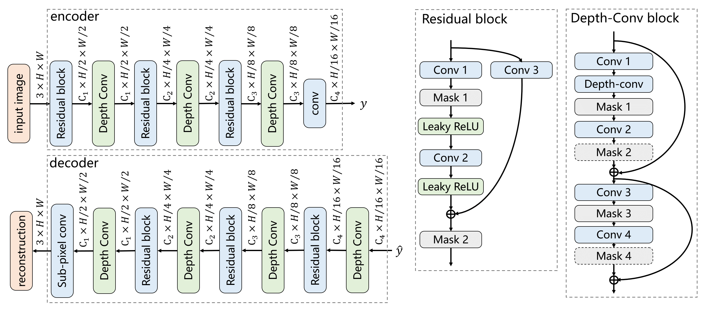
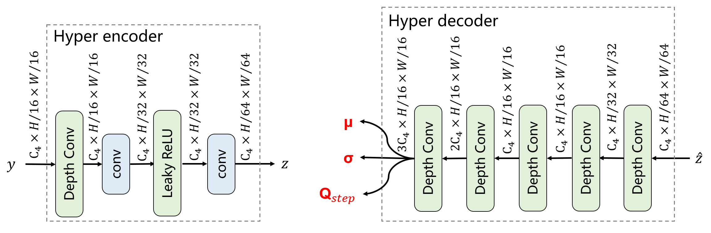
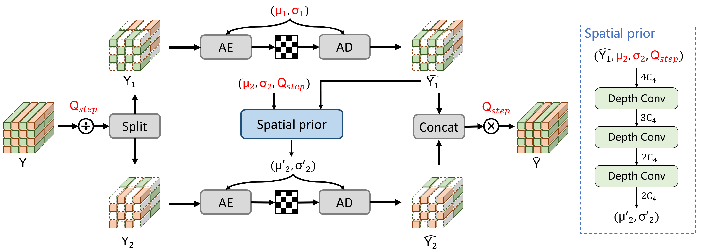
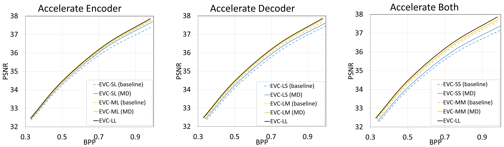

# EVC: Towards Real-Time Neural Image Compression with Mask Decay

This is the official Pytorch implementation for [EVC: Towards Real-Time Neural Image Compression with Mask Decay](https://openreview.net/forum?id=XUxad2Gj40n), in ICLR 2023.

## Prerequisites

Environment:
```bash
conda create -n $YOUR_PY38_ENV_NAME python=3.8
conda activate $YOUR_PY38_ENV_NAME
conda install pytorch=1.11.0 torchvision=0.12.0 torchaudio=0.11.0 cudatoolkit=11.3 -c pytorch
pip install -r requirements.txt
```

If you want to test the model with writing bitstream, please build this project.

### On Windows
```bash
cd src
mkdir build
cd build
conda activate $YOUR_PY38_ENV_NAME
cmake ../cpp -G "Visual Studio 16 2019" -A x64
cmake --build . --config Release
```

### On Linux
```bash
sudo apt-get install cmake g++
cd src
mkdir build
cd build
conda activate $YOUR_PY38_ENV_NAME
cmake ../cpp -DCMAKE_BUILD_TYPE=Release
make -j
```

## Test Dataset

Please download the Kodak dataset from [http://r0k.us/graphics/kodak/](http://r0k.us/graphics/kodak/).

The folder is organized as
```
.../kodak/
  - kodim01.png
  - kodim02.png
  - ...
```

Please modify the `root_path` in `test_cfg/local_kodak.json` to match the data location.

# Pretrained Models

* Download our [pretrained models](https://1drv.ms/u/s!AozfVVwtWWYoiUhZLZDx7vJjHK1C?e=qETpA1) and put them into ./checkpoints folder.
* Or run the script in ./checkpoints directly to download the model.

|  i_frame_model   | i_frame_model_path  |
|  :---:  | :----:  |
| EVC_LL  | EVC_LL.pth.tar    |
| EVC_ML  | EVC_ML_MD.pth.tar |
| EVC_SL  | EVC_SL_MD.pth.tar |
| EVC_LM  | EVC_LM_MD.pth.tar |
| EVC_LS  | EVC_LS_MD.pth.tar |
| EVC_MM  | EVC_MM_MD.pth.tar |
| EVC_SS  | EVC_SS_MD.pth.tar |
| Scale_EVC_SL  | Scale_EVC_SL_MDRRL.pth.tar |
| Scale_EVC_SS  | Scale_EVC_SS_MDRRL.pth.tar |

# Test the Models

We use `test_image_codec.py` to test our models. Please check this file and make sure you have downloaded models in `checkpoints`. Then, just run
```
python run_test_image.py
```

If you want to test with actual bitstream writing, set `--write_stream 1` in `command_line`.

## CPU performance scaling

Note that the arithmetic coding runs on the CPU, please make sure your CPU runs at high performance while writing the actual bitstream. Otherwise, the arithmetic coding may take a long time.

Check the CPU frequency by
```
grep -E '^model name|^cpu MHz' /proc/cpuinfo
```

Run the following command to maximum CPU frequency
```
echo performance | sudo tee /sys/devices/system/cpu/cpu*/cpufreq/scaling_governor
```

Run the following command to recover the default frequency
```
echo ondemand | sudo tee /sys/devices/system/cpu/cpu*/cpufreq/scaling_governor
```

# Architecture

The framework:



The encoder and decoder:



The hyperprior:



The dual prior:




# R-D Curves



# Citation

If you find the work useful for your research, please cite:
```
@inproceedings{wang2023EVC,
  title={EVC: Towards Real-Time Neural Image Compression with Mask Decay},
  author={Wang, Guo-Hua and Li, Jiahao and Li, Bin and Lu, Yan},
  booktitle={International Conference on Learning Representations},
  year={2023}
}
```

# Acknowledgement

* CompressAI: [https://github.com/InterDigitalInc/CompressAI](https://github.com/InterDigitalInc/CompressAI)