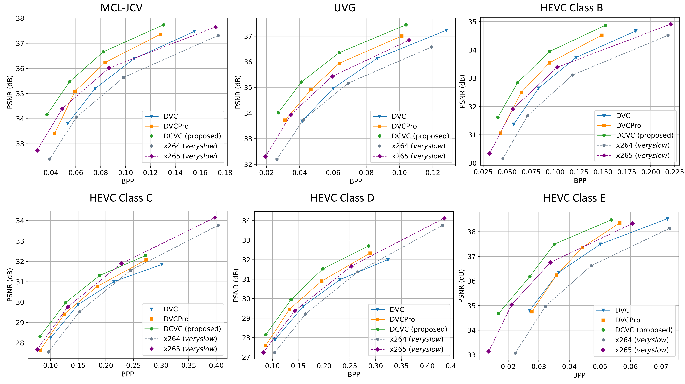

# Introduction

Official Pytorch implementation for [Deep Contextual Video Compression](https://proceedings.neurips.cc/paper/2021/file/96b250a90d3cf0868c83f8c965142d2a-Paper.pdf), NeurIPS 2021

# Prerequisites
* Python 3.8 and conda, get [Conda](https://www.anaconda.com/)
* CUDA 11.0
* Environment
    ```
    conda create -n $YOUR_PY38_ENV_NAME python=3.8
    conda activate $YOUR_PY38_ENV_NAME
    
    pip install torch==1.7.1+cu110 torchvision==0.8.2+cu110 torchaudio==0.7.2 -f https://download.pytorch.org/whl/torch_stable.html
    python -m pip install -r requirements.txt
    ```


# Test dataset
Currenlty the spatial resolution of video needs to be cropped into the integral times of 64.

The dataset format can be seen in dataset_config_example.json. 

For example, one video of HEVC Class B can be prepared as:
* Crop the original YUV via ffmpeg:
    ```
    ffmpeg -pix_fmt yuv420p  -s 1920x1080 -i  BasketballDrive_1920x1080_50.yuv -vf crop=1920:1024:0:0 BasketballDrive_1920x1024_50.yuv
    ```
* Make the video path:
    ```
    mkdir BasketballDrive_1920x1024_50
    ```
* Convert YUV to PNG:
    ```
    ffmpeg -pix_fmt yuv420p -s 1920x1024 -i BasketballDrive_1920x1024_50.yuv   -f image2 BasketballDrive_1920x1024_50/im%05d.png
    ```
At last, the folder structure of dataset is like:

    /media/data/HEVC_B/
        * BQTerrace_1920x1024_60/
            - im00001.png
            - im00002.png
            - im00003.png
            - ...
        * BasketballDrive_1920x1024_50/
            - im00001.png
            - im00002.png
            - im00003.png
            - ...
        * ...
    /media/data/HEVC_D
    /media/data/HEVC_C/
    ...

# Pretrained models

* Download CompressAI models
    ```
    cd checkpoints/
    python download_compressai_models.py
    cd ..
    ```

* Download [DCVC models](https://1drv.ms/u/s!AozfVVwtWWYoiS5mcGX320bFXI0k?e=iMeykH) and put them into /checkpoints folder.

# Test DCVC

Example of test the PSNR model:
```bash
python test_video.py --i_frame_model_name cheng2020-anchor  --i_frame_model_path  checkpoints/cheng2020-anchor-3-e49be189.pth.tar  checkpoints/cheng2020-anchor-4-98b0b468.pth.tar   checkpoints/cheng2020-anchor-5-23852949.pth.tar   checkpoints/cheng2020-anchor-6-4c052b1a.pth.tar  --test_config     dataset_config_example.json  --cuda true --cuda_device 0,1,2,3   --worker 4   --output_json_result_path  DCVC_result_psnr.json    --model_type psnr  --recon_bin_path recon_bin_folder_psnr --model_path checkpoints/model_dcvc_quality_0_psnr.pth  checkpoints/model_dcvc_quality_1_psnr.pth checkpoints/model_dcvc_quality_2_psnr.pth checkpoints/model_dcvc_quality_3_psnr.pth
```

Example of test the MSSSIM model:
```bash
python test_video.py --i_frame_model_name bmshj2018-hyperprior  --i_frame_model_path  checkpoints/bmshj2018-hyperprior-ms-ssim-3-92dd7878.pth.tar checkpoints/bmshj2018-hyperprior-ms-ssim-4-4377354e.pth.tar    checkpoints/bmshj2018-hyperprior-ms-ssim-5-c34afc8d.pth.tar    checkpoints/bmshj2018-hyperprior-ms-ssim-6-3a6d8229.pth.tar   --test_config   dataset_config_example.json  --cuda true --cuda_device 0,1,2,3   --worker 4   --output_json_result_path  DCVC_result_msssim.json  --model_type msssim  --recon_bin_path recon_bin_folder_msssim --model_path checkpoints/model_dcvc_quality_0_msssim.pth checkpoints/model_dcvc_quality_1_msssim.pth checkpoints/model_dcvc_quality_2_msssim.pth checkpoints/model_dcvc_quality_3_msssim.pth
```
It is recommended that the ```--worker``` number is equal to your GPU number.

# R-D Curve of DCVC


# Acknowledgement
The implementation is based on [CompressAI](https://github.com/InterDigitalInc/CompressAI) and [PyTorchVideoCompression](https://github.com/ZhihaoHu/PyTorchVideoCompression). The model weights of intra coding come from [CompressAI](https://github.com/InterDigitalInc/CompressAI).

# Citation
If you find this work useful for your research, please cite:

```
@article{li2021deep,
  title={Deep Contextual Video Compression},
  author={Li, Jiahao and Li, Bin and Lu, Yan},
  journal={Advances in Neural Information Processing Systems},
  volume={34},
  year={2021}
}
```

# Trademarks
This project may contain trademarks or logos for projects, products, or services. Authorized use of Microsoft trademarks or logos is subject to and must follow [Microsoft’s Trademark & Brand Guidelines](https://www.microsoft.com/en-us/legal/intellectualproperty/trademarks/usage/general). Use of Microsoft trademarks or logos in modified versions of this project must not cause confusion or imply Microsoft sponsorship. Any use of third-party trademarks or logos are subject to those third-party’s policies.
