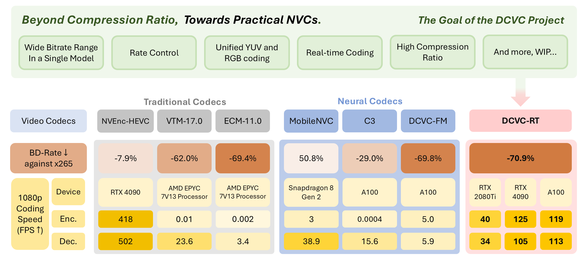
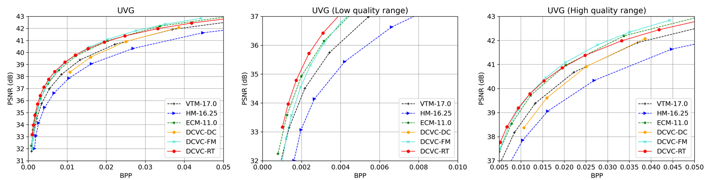
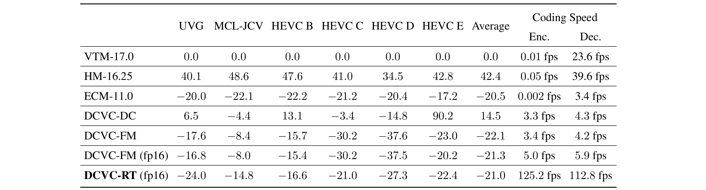
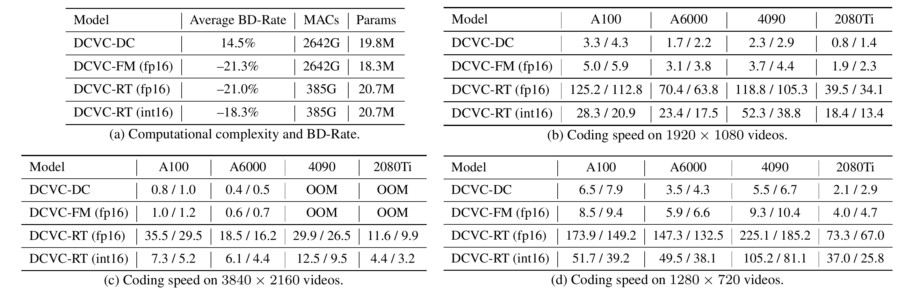

<div align="center">

# DCVC-RT: Towards Practical Real-Time Neural Video Compression

**CVPR2025**

</div>

[](https://dcvccodec.github.io//)
[](https://arxiv.org/abs/2502.20762)




**DCVC-RT is the first neural video codec (NVC)  achieving 100+ FPS 1080p coding and 4K real-time coding with a comparable compression ratio with ECM. Beyond this, DCVC-RT pursue a more practical neural video codec solution and  supports various practical features, including:**
- **Wide bitrate range in single model**: A single model enables continuous and controllable bitrate adjustments. DCVC-RT can compress at a wide bitrate range for different coding scenarios.
- **Rate control**: By adjusting quantization parameters, DCVC-RT effectively supports dynamic and various network conditions during real communication scenario.
- **Unified YUV and RGB coding**: While DCVC-RT is primarily optimized for the widely adopted YUV format, it can seamlessly adapt to RGB content coding.

We are continuously exploring additional practical functionalities and will provide further NVC solutions in this repository.

## :book: Overview

Welcome to the official implementation of DCVC-RT and the broader [DCVC-family](DCVC-family/README.md) models. The DCVC (Deep Contextual Video Compression) family is designed to push the boundaries of high-performance practical neural video codecs, delivering cutting-edge compression efficiency, real-time capabilities, and versatile functionalities.

:rocket: In this section, we provide a brief overview of DCVC-RT. For an in-depth understanding, we encourage you to read our [paper](https://arxiv.org/abs/2502.20762). 

:hammer: Ready to get started? Head over to the [usage](#hammer-usage) to start using this repo. 

:page_facing_up: If you find our work helpful, feel free to [cite](#page_facing_up-citation) us. We truly appreciate your support.


### Abstract

We introduce a practical real-time neural video codec (NVC) designed to deliver high compression ratio, low latency and broad versatility. In practice, the coding speed of NVCs depends on 1) computational costs, and 2) non-computational operational costs, such as memory I/O and the number of function calls. While most efficient NVCs prioritize reducing computational cost, we identify operational cost as the primary bottleneck to achieving higher coding speed. Leveraging this insight, we introduce a set of efficiency-driven design improvements focused on minimizing operational costs. Specifically, we employ implicit temporal modeling to eliminate complex explicit motion modules, and use single low-resolution latent representations rather than progressive downsampling. These innovations significantly accelerate NVC without sacrificing compression quality. Additionally, we implement model integerization for consistent cross-device coding and a module-bank-based rate control scheme to improve practical adaptability. Experiments show our proposed DCVC-RT achieves an impressive average encoding/decoding speed at 125.2/112.8 fps (frames per second) for 1080p video, while saving an average of 21\% in bitrate compared to H.266/VTM. 


### Video Compression Performance
Bit saving over VTM-17.0 (UVG all frames with single intra-frame setting (i.e. intra-period = –1) and YUV420 colorspace.)



The BD-Rate and 1080p encoding/decoding speed on NVIDIA A100 GPU




The complexity analysis and encoding/decoding speed evaluation across various resolutions and devices.




### Image Compression Performance

Notably, the intra-frame codec in DCVC-RT also delivers impressive performance. On Kodak, DCVC-RT-Intra achieves an 11.1% bitrate reduction compared to VTM, with a over 10× faster decoding speed than previous state-of-the-art learned image codecs. For encoding, DCVC-RT-Intra also offers a similar speed advantage. For 1080p content, DCVC-RT-Intra achieves an impressive encoding/decoding speed of 40.7 FPS / 44.2 FPS on an NVIDIA A100 GPU.


## :hammer: Usage

For each step, click it to expand and view details.

<details>
  <summary><font size="5"> Prerequisites</font></summary><br>

* Python 3.12 and conda, get [Conda](https://www.anaconda.com/)
* CUDA 12.6 (other versions may also work. Make sure the CUDA version matches with pytorch.)
* pytorch (We have tested that pytorch-2.6 works. Other versions may also work.)
* Environment
    ```
    conda create -n $YOUR_PY_ENV_NAME python=3.12
    conda activate $YOUR_PY_ENV_NAME

    pip install torch torchvision torchaudio --index-url https://download.pytorch.org/whl/cu126
    pip install -r requirements.txt
    ```

</details>

<details>

  <summary><font size="5"> Build the project</font></summary><br>

Please build the C++ code to support bitstream writing and customized CUDA kernels to fuse operations.

```bash
sudo apt-get install cmake g++ ninja-build
conda activate $YOUR_PY_ENV_NAME
cd ./src/cpp/
pip install .
cd ../layers/extensions/inference/
pip install .
```

If the CUDA kernels fail to load successfully in infererence, the standard output will display: ```cannot import cuda implementation for inference, fallback to pytorch.```

</details>

<details>

  <summary><font size="5"> CPU performance scaling</font></summary><br>

Note that the arithmetic coding runs on the CPU, please make sure your CPU runs at high performance while writing the actual bitstream. Otherwise, the arithmetic coding may take a long time.

Check the CPU frequency by
```
grep -E '^model name|^cpu MHz' /proc/cpuinfo
```

Run the following command to maximum CPU frequency
```
echo performance | sudo tee /sys/devices/system/cpu/cpu*/cpufreq/scaling_governor
```

Run the following command to recover the default frequency
```
echo ondemand | sudo tee /sys/devices/system/cpu/cpu*/cpufreq/scaling_governor
```

</details>

<details>

  <summary><font size="5"> Pretrained models</font></summary><br>

* Download [our pretrained models](https://1drv.ms/f/c/2866592d5c55df8c/Esu0KJ-I2kxCjEP565ARx_YB88i0UnR6XnODqFcvZs4LcA?e=by8CO8) and put them into ./checkpoints folder.
* There are 2 models, one for image coding and the other for video coding.
* As a backup, all the pretrained models could be found [here](https://1drv.ms/f/c/2866592d5c55df8c/EozfVVwtWWYggCitBAAAAAABbT4z2Z10fMXISnan72UtSA?e=BID7DA).


</details>

<details>

  <summary><font size="5"> Test dataset</font></summary><br>

We support arbitrary original resolution. The input video resolution will be padded automatically. The reconstructed video will be cropped back to the original size. The distortion (PSNR) is calculated at original resolution.

#### YUV 420 content

Put *.yuv in the folder structure similar to the following structure.

    /media/data/HEVC_B/
        - BQTerrace_1920x1080_60.yuv
        - BasketballDrive_1920x1080_50.yuv
        - ...
    /media/data/HEVC_D/
    /media/data/HEVC_C/
    ...

The dataset structure can be seen in dataset_config_example_yuv420.json.

#### RGB content

We highly suggest testing YUV420 content. To test RGB content, please refer to the [DCVC-FM](DCVC-family/DCVC-FM) folder.

</details>

<details>

  <summary><font size="5"> Test the models</font></summary><br>

Example to test pretrained model with four rate points:
```bash
 python test_video.py --model_path_i ./checkpoints/cvpr2025_image.pth.tar --model_path_p ./checkpoints/cvpr2025_video.pth.tar --rate_num 4 --test_config ./dataset_config_example_yuv420.json --cuda 1 -w 1 --write_stream 1 --force_zero_thres 0.12 --output_path output.json --force_intra_period -1 --reset_interval 64 --force_frame_num -1 --check_existing 0 --verbose 0
```

It is recommended that the ```-w``` number is equal to your GPU number.

You can also specify different ```--rate_num``` values (2~64) to test finer bitrate adjustment.

To measure coding speed, you can set  ```--verbose``` value to `1` (sequence-level measuring) or `2` (frame-level measuring). This will automatically measure encoding and decoding speeds, print them in the terminal, and record the average speeds in ```avg_frame_encoding_time``` and ```avg_frame_decoding_time``` in the output JSON file. 
- Note that ```test_time``` is the total testing time for the entire sequence, which includes I/O time, encoding time, decoding time, and distortion calculation time. The overhead from I/O and distortion calculation is much larger than the encoding/decoding time itself, so we exclude these overheads to measure the precise coding time.
- Additionally, please make sure ```time.time()``` provides sufficient precision on the tested platform. For instance, our experience is that the precision is adequate on our Ubuntu device, but insufficient on our Windows device.

</details>

<details>

  <summary><font size="5"> On the comparison</font></summary><br>

Please note that different methods may use different configurations to test different models, such as
* Source video may be different, e.g., cropped or padded to the desired resolution.
* Intra period may be different, e.g., 96, 32, 12, or 10.
* Number of encoded frames may be different.

So, it does not make sense to compare the numbers in different methods directly, unless making sure they are using same test conditions.

Please find more details on the [test conditions](./test_conditions.md).

</details>


## :clipboard: DCVC-family

DCVC-RT builds on the success of the DCVC family of models. The details of DCVC family models can be found in [DCVC-family](DCVC-family/README.md).

<table>
  <tr>
    <th>Model</th>
    <th>Paper</th>
    <th>Code</th>
    <th>Checkpoint</th>
  </tr>
  <tr>
    <td>DCVC</td>
    <td> 
      <a href="https://proceedings.neurips.cc/paper/2021/file/96b250a90d3cf0868c83f8c965142d2a-Paper.pdf">Paper (NeurIPS 2021)</a> & 
      <a href="https://arxiv.org/abs/2109.15047">Paper (arXiv)</a>
    </td>
    <td> <a href="DCVC-family/DCVC">Code</a></td>
    <td><a href="https://1drv.ms/u/s!AozfVVwtWWYoiS5mcGX320bFXI0k?e=iMeykH">Checkpoints</a></td>
  </tr>
  <tr>
    <td>DCVC-TCM</td>
    <td>
      <a href="https://ieeexplore.ieee.org/document/9941493">Paper (IEEE TMM)</a> & 
      <a href="https://arxiv.org/abs/2111.13850">Paper (arXiv)</a>
    </td>
    <td><a href="DCVC-family/DCVC-TCM">Code</a></td>
    <td><a href="https://onedrive.live.com/?authkey=%21ADwwaonwTGR%5FNR8&id=2866592D5C55DF8C%211234&cid=2866592D5C55DF8C">Checkpoints</a></td>
  </tr>
  <tr>
    <td>DCVC-HEM</td>
    <td>
      <a href="https://dl.acm.org/doi/abs/10.1145/3503161.3547845">Paper (ACM MM 2022)</a> & 
      <a href="https://arxiv.org/abs/2207.05894">Paper (arXiv)</a>
    </td>
    <td><a href="DCVC-family/DCVC-HEM">Code</a></td>
    <td><a href="https://1drv.ms/u/s!AozfVVwtWWYoiUAGk6xr-oELbodn?e=kry2Nk">Checkpoints</a></td>
  </tr>
  <tr>
    <td>DCVC-DC</td>
    <td>
      <a href="https://openaccess.thecvf.com/content/CVPR2023/papers/Li_Neural_Video_Compression_With_Diverse_Contexts_CVPR_2023_paper.pdf">Paper (CVPR 2023)</a> & 
      <a href="https://arxiv.org/abs/2302.14402">Paper (arXiv)</a>
    </td>
    <td><a href="DCVC-family/DCVC-DC">Code</a></td>
    <td><a href="https://1drv.ms/u/s!AozfVVwtWWYoiWdwDhEkZMIfpon5?e=JcGri5">Checkpoints</a></td>
  </tr>
  <tr>
    <td>DCVC-FM</td>
    <td>
      <a href="https://openaccess.thecvf.com/content/CVPR2024/papers/Li_Neural_Video_Compression_with_Feature_Modulation_CVPR_2024_paper.pdf">Paper (CVPR 2024)</a> & 
      <a href="https://arxiv.org/abs/2402.17414">Paper (arXiv)</a>
    </td>
    <td><a href="DCVC-family/DCVC-FM">Code</a></td>
    <td><a href="https://1drv.ms/f/s!AozfVVwtWWYoi1QkAhlIE-7aAaKV?e=OoemTr">Checkpoints</a></td>
  </tr>
  <tr>
    <td>DCVC-RT</td>
    <td>
      <a href="https://arxiv.org/abs/2502.20762">Paper (arXiv)</a>
    </td>
    <td><a href="https://github.com/microsoft/DCVC/tree/main">Code</a></td>
    <td><a href="https://1drv.ms/f/c/2866592d5c55df8c/Esu0KJ-I2kxCjEP565ARx_YB88i0UnR6XnODqFcvZs4LcA?e=by8CO8">Checkpoints</a></td>
  </tr>
  <tr>
    <td>EVC</td>
    <td>
      <a href="https://openreview.net/forum?id=XUxad2Gj40n">Paper (ICLR 2023)</a> & 
      <a href="https://arxiv.org/abs/2302.05071">Paper (arXiv)</a>
    </td>
    <td><a href="DCVC-family/EVC">Code</a></td>
    <td><a href="https://1drv.ms/u/s!AozfVVwtWWYoiUhZLZDx7vJjHK1C?e=qETpA1">Checkpoints</a></td>
  </tr>
</table>

* As a backup, all the pretrained models could be found [here](https://1drv.ms/f/c/2866592d5c55df8c/EozfVVwtWWYggCitBAAAAAABbT4z2Z10fMXISnan72UtSA?e=BID7DA).

## :page_facing_up: Citation
If you find this work useful for your research, please cite:

<details>

  <summary><font size="3"> BibTeX (click to expand) </font></summary><br>

```
@article{li2021deep,
  title={Deep Contextual Video Compression},
  author={Li, Jiahao and Li, Bin and Lu, Yan},
  journal={Advances in Neural Information Processing Systems},
  volume={34},
  year={2021}
}

@article{sheng2022temporal,
  title={Temporal context mining for learned video compression},
  author={Sheng, Xihua and Li, Jiahao and Li, Bin and Li, Li and Liu, Dong and Lu, Yan},
  journal={IEEE Transactions on Multimedia},
  year={2022},
  publisher={IEEE}
}

@inproceedings{li2022hybrid,
  title={Hybrid Spatial-Temporal Entropy Modelling for Neural Video Compression},
  author={Li, Jiahao and Li, Bin and Lu, Yan},
  booktitle={Proceedings of the 30th ACM International Conference on Multimedia},
  year={2022}
}

@inproceedings{li2023neural,
  title={Neural Video Compression with Diverse Contexts},
  author={Li, Jiahao and Li, Bin and Lu, Yan},
  booktitle={{IEEE/CVF} Conference on Computer Vision and Pattern Recognition,
             {CVPR} 2023, Vancouver, Canada, June 18-22, 2023},
  year={2023}
}

@inproceedings{li2024neural,
  title={Neural Video Compression with Feature Modulation},
  author={Li, Jiahao and Li, Bin and Lu, Yan},
  booktitle={{IEEE/CVF} Conference on Computer Vision and Pattern Recognition,
             {CVPR} 2024, Seattle, WA, USA, June 17-21, 2024},
  year={2024}
}

@inproceedings{jia2025towards,
  title={Towards Practical Real-Time Neural Video Compression},
  author={Jia, Zhaoyang and Li, Bin and Li, Jiahao and Xie, Wenxuan and Qi, Linfeng and Li, Houqiang and Lu, Yan},
  booktitle={{IEEE/CVF} Conference on Computer Vision and Pattern Recognition,
             {CVPR} 2025, Nashville, TN, USA, June 11-25, 2024},
  year={2025}
}

@inproceedings{wang2023EVC,
  title={EVC: Towards Real-Time Neural Image Compression with Mask Decay},
  author={Wang, Guo-Hua and Li, Jiahao and Li, Bin and Lu, Yan},
  booktitle={International Conference on Learning Representations},
  year={2023}
}
```
</details>


## Acknowledgement

The implementation of DCVC-RT is based on [CompressAI](https://github.com/InterDigitalInc/CompressAI).

## Trademarks
This project may contain trademarks or logos for projects, products, or services. Authorized use of Microsoft trademarks or logos is subject to and must follow [Microsoft’s Trademark & Brand Guidelines](https://www.microsoft.com/en-us/legal/intellectualproperty/trademarks/usage/general). Use of Microsoft trademarks or logos in modified versions of this project must not cause confusion or imply Microsoft sponsorship. Any use of third-party trademarks or logos are subject to those third-party’s policies.
