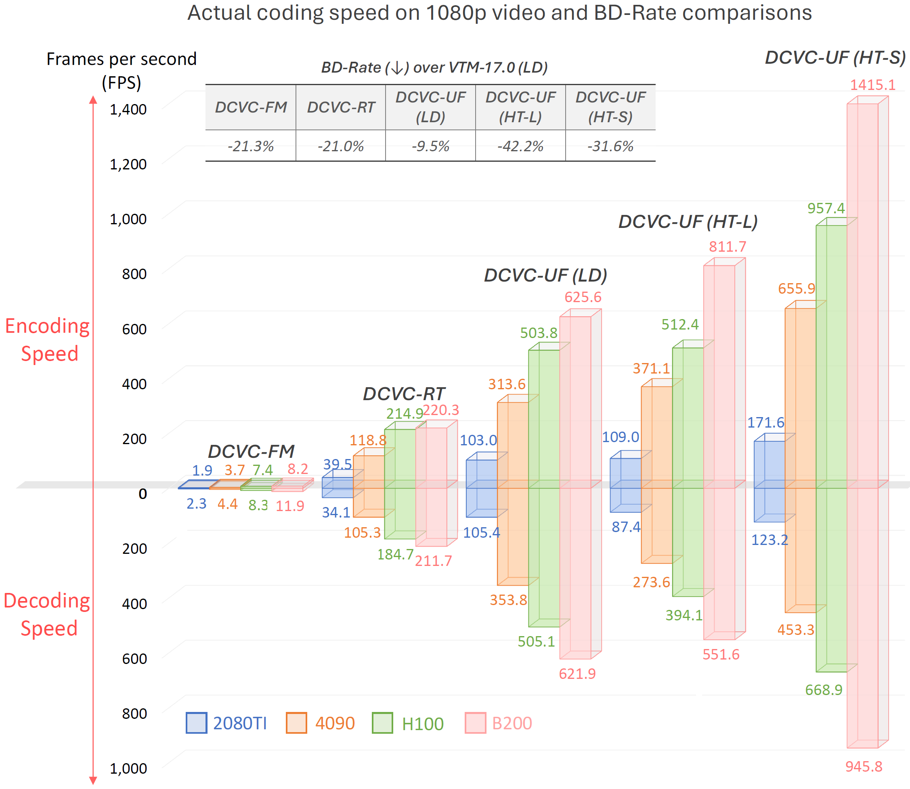
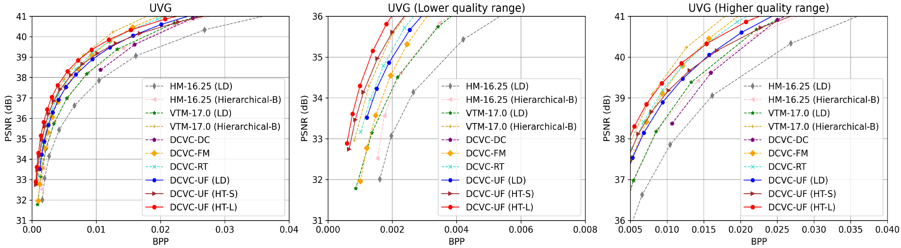
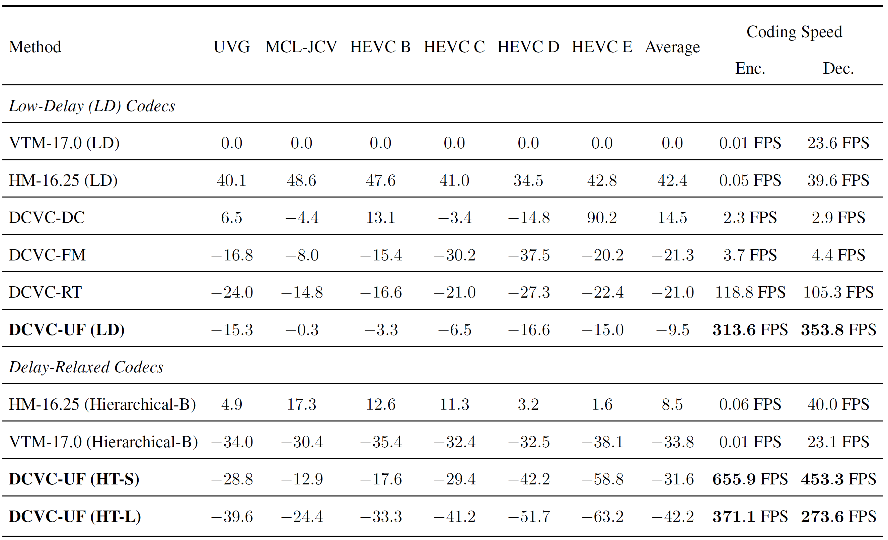
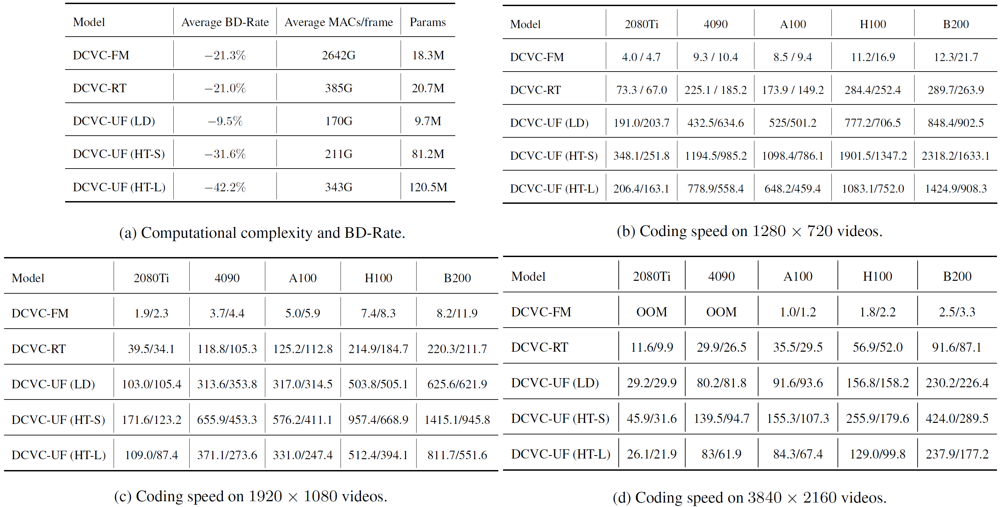
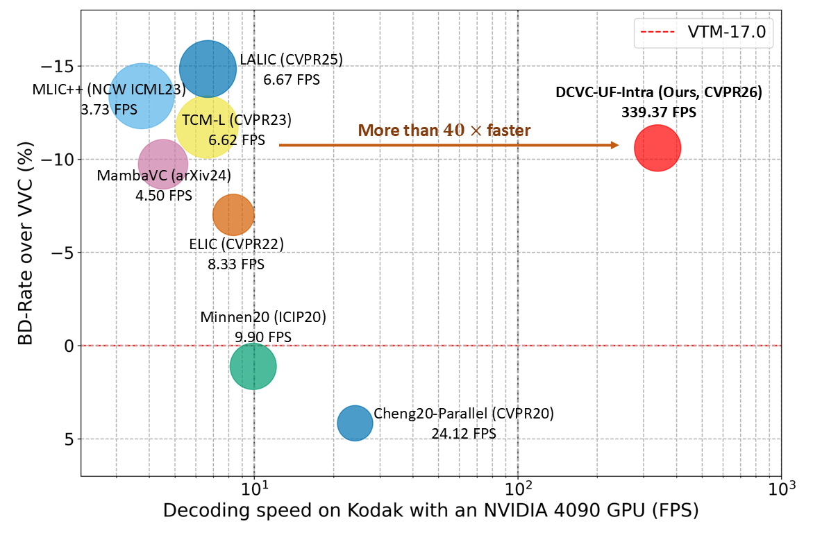

<div align="center">

# DCVC-UF: Ultra-Fast Neural Video Compression

**CVPR2026**

</div>

[](https://dcvccodec.github.io/)
[](https://arxiv.org/abs/2606.04410)




> [!IMPORTANT]
> # 🎉 News: training code released — see [training.md](training.md).

**DCVC-UF is an end-to-end neural video codec (NVC) introducing a chunk-based coding framework that achieves ultra-fast encoding and decoding speeds while maintaining high compression efficiency.**

**DCVC-UF supports various practical features, including:**
- **Wide bitrate range in single model**: A single model with 64 QP levels enables continuous and fine-grained bitrate adjustments across a wide bitrate range.
- **Rate control**: By adjusting quantization parameters, DCVC-UF effectively supports dynamic and various network conditions during real communication scenario.
- **Unified YUV and RGB coding**: While DCVC-UF is primarily optimized for the widely adopted YUV420 format, it can seamlessly adapt to RGB content coding.

We are continuously exploring additional practical functionalities and will provide further NVC solutions in this repository.

## :book: Overview

Welcome to the official implementation of DCVC-UF and the broader [DCVC-family](DCVC-family/README.md) models. The DCVC (Deep Contextual Video Compression) family is designed to push the boundaries of high-performance practical neural video codecs, delivering cutting-edge compression efficiency, ultra-fast coding speeds, and versatile functionalities.

:rocket: In this section, we provide a brief overview of DCVC-UF. For an in-depth understanding, we encourage you to read our [paper](https://arxiv.org/abs/2606.04410).

:hammer: Ready to get started? Head over to the [usage](#hammer-usage) to start using this repo.

:page_facing_up: If you find our work helpful, feel free to [cite](#page_facing_up-citation) us. We truly appreciate your support.

### Abstract

While neural video codecs (NVCs) have demonstrated superior compression ratio, their prohibitive computational complexity remains a critical barrier to real-world deployment. This paper introduces a chunk-based coding framework designed to significantly improve the rate-distortion-complexity trade-off. Instead of processing frames sequentially, our approach encodes a chunk of multiple frames into a single compact latent representation and decodes them simultaneously. This is enabled by cross-frame interaction modules for joint spatial-temporal modeling and frame-specific decoders for parallel reconstruction. This paradigm not only dramatically enhances coding throughput but also facilitates more effective modeling of long-term temporal correlations. To further boost speed, we propose a streamlined entropy coding mechanism that consolidates bit-stream interactions into a single step, substantially reducing decoding overhead. Building on these innovations, we present DCVC-UF (Ultra-Fast), a new NVC that sets a new SOTA in performance. Our experiments show that DCVC-UF can achieve ultra-fast encoding and decoding speeds, significantly outperforming previous leading codecs. DCVC-UF serves as a notable landmark in the journey of NVC evolution. Both training and testing codes will be released.

### Video Compression Performance

Bit saving over VTM-17.0 on UVG (all frames, single intra-frame setting with intra-period = -1, YUV420 colorspace).



BD-Rate and 1080p encoding/decoding speed on NVIDIA 4090 GPU:



Complexity analysis and encoding/decoding speed across various resolutions and devices:



### Image Compression Performance

Notably, the intra-frame codec in DCVC-UF also delivers impressive performance. On Kodak, DCVC-UF-Intra achieves an 10.6% bitrate reduction compared to VTM, with an over 40× faster decoding speed than previous state-of-the-art learned image codecs. For encoding, DCVC-UF-Intra also offers a similar speed advantage. For 1080p content, DCVC-UF-Intra achieves an impressive encoding/decoding speed of 81.5 FPS / 95.0 FPS on an NVIDIA A100 GPU.



## :hammer: Usage

Click any step below to expand its details.

<details>
<summary><font size="5">Prerequisites</font></summary><br>

* Python 3.12 and conda, get [Conda](https://www.anaconda.com/)
* CUDA 13.0 (other versions may also work. Make sure the CUDA version matches with pytorch.)
* pytorch (We have tested that pytorch-2.9.1 works. Other versions may also work.)
* Environment
    ```
    conda create -n $YOUR_PY_ENV_NAME python=3.12
    conda activate $YOUR_PY_ENV_NAME

    pip install torch torchvision torchaudio --index-url https://download.pytorch.org/whl/cu130
    pip install -r requirements.txt
    ```

</details>

<details>
<summary><font size="5">Build the project</font></summary><br>

Two C++/CUDA extensions must be built:

1. **MLCodec_extensions_cpp** — rANS entropy coder (pybind11)
2. **inference_extensions_cuda** — Fused inference kernels (CUTLASS-based)

```bash
git clone https://github.com/NVIDIA/cutlass third_party/cutlass
cd third_party/cutlass
git checkout v4.4.1
cd ../../src/cpp/
bash install.sh
cd ../layers/extensions/inference/
bash install.sh
```
</details>

<details>
<summary><font size="5">CPU performance scaling</font></summary><br>

The arithmetic coding runs on the CPU. Make sure your CPU runs at maximum frequency while encoding/decoding actual bitstreams, otherwise the entropy coding may bottleneck throughput. After each reboot, the CPU scaling governor may reset.

Check current CPU frequency:
```bash
grep -E '^model name|^cpu MHz' /proc/cpuinfo
```

Set high-performance mode:
```bash
echo performance | sudo tee /sys/devices/system/cpu/cpu*/cpufreq/scaling_governor
```

Restore default:
```bash
echo ondemand | sudo tee /sys/devices/system/cpu/cpu*/cpufreq/scaling_governor
```
</details>

<details>
<summary><font size="5">Pretrained models</font></summary><br>

* Download [our pretrained models](https://1drv.ms/f/c/2866592d5c55df8c/IgAalzb_985lQ79GkXyW2P5OASPpZHHcrcGWEVQxO-mQCVg?e=qyvMN6) and put them into `./checkpoints` folder.
* There are 4 checkpoints, one for image coding and three for video coding (HT-L, HT-S, LD variants).
* As a backup, all the pretrained models could be found [here](https://1drv.ms/f/c/2866592d5c55df8c/EozfVVwtWWYggCitBAAAAAABbT4z2Z10fMXISnan72UtSA?e=BID7DA).
</details>

<details>
<summary><font size="5">Test dataset</font></summary><br>

We support arbitrary original resolution. The input video resolution will be padded automatically. The reconstructed video will be cropped back to the original size. The distortion (PSNR) is calculated at original resolution.

#### YUV 420 content

Put *.yuv in the folder structure similar to the following structure.

```
/data/test_sequences/
├── UVG/
│   ├── Beauty_1920x1080_120fps_420_8bit_YUV.yuv
│   ├── Bosphorus_1920x1080_120fps_420_8bit_YUV.yuv
│   └── ...
├── MCL-JCV/
│   ├── videoSRC01_1920x1080_30.yuv
│   └── ...
└── ...
```

The dataset structure can be seen in `test_cfg/all_yuv420.json`.

#### RGB content

Organize PNG sequences with numbered filenames (`im00001.png`, `im00002.png`, ...). The dataset structure can be seen in `test_cfg/all_RGB.json`.

</details>

<details>
<summary><font size="5">Test the models</font></summary><br>

```bash
python test_video.py \
    --model_path_i checkpoints/cvpr2026_image.pth.tar \
    --model_path_p checkpoints/cvpr2026_video_hts.pth.tar \
    --model_structure hts \
    --rate_num 4 \
    --test_config test_cfg/all_yuv420.json \
    --output_path output.json \
    --cuda_idx 0 \
    -w 1 \
    --verbose 0 \
    --skip_thres 0.15 \
    --force_intra 0 \
    --reset_interval 128
```

**Parameters:**
- `--model_structure {htl, hts, ld}`: Select the video model variant (HT-L, HT-S, or LD).
- `--rate_num N`: Number of rate points to test. QP values are uniformly sampled from the 64 available levels. You can also specify exact QP values with `--qp_i` and `--qp_p`.
- `--cuda_idx ID [ID ...]`: GPU device indices to use (e.g., `--cuda_idx 0 1 3`). Workers are distributed across the specified GPUs.
- `-w N`: Number of parallel workers (processes). Workers are equally spread among GPUs.
- `--verbose {0, 1, 2}`: Timing verbosity. `0` = no timing, `1` = per-sequence summary, `2` = per-frame timing.
- `--skip_thres T`: Skip threshold for adaptive entropy coding (default: 0).
- `--force_intra 1`: Test image coding only (I-frames only).

**Output:** A JSON file with per-sequence BPP, PSNR (RGB and YUV components), MS-SSIM, and encoding/decoding timing.
</details>

<details>
<summary><font size="5">Measure compression speed</font></summary><br>

```bash
python test_compress_time.py --model_structure hts
```

**Parameters:**
- `--model_structure {htl, hts, ld}`: Select the video model variant (HT-L, HT-S, or LD).

This runs the codec on a benchmark configuration and reports average encoding/decoding time (ms/frame) and throughput (fps), accounting for chunk size.

> **⚠️ Note:** The coding speed has been profiled and optimized for the following resolutions: 3840x2160, 1920x1080, 1280x720, 832x480, and 416x240, on the following NVIDIA GPUs: 2080Ti, 4090, A100, H100, and B200. For other resolutions and devices, the coding speed is not guaranteed to be optimal.

</details>

<details>
<summary><font size="5">Compare models (BD-rate)</font></summary><br>

First test each model with `test_video.py` and save results to JSON files. Then compare:

```bash
python compare_bd_rate.py \
    --compare_between class \
    --compare_frame_type all \
    --output_path stdout \
    --base_method VTM \
    --log_paths VTM anchors/vtm_17.0_yuv420_LB_allf_ip0.json \
                DMC-test output.json \
    --plot_rd_curve 1 \
    --plot_path test_room/figs \
    --distortion_metrics psnr
```

**Parameters:**
- `--compare_between {class, sequence}`: Aggregate BD-rate by class or report per-sequence.
- `--compare_frame_type {default, all}`: Frame type for BD-rate comparison. `default` compares I-frame, P-frame, and all-frame separately; `all` compares all-frame only.
- `--output_path PATH`: Output destination. Use `stdout` to print to console, or specify a `.txt`/`.csv` file path.
- `--base_method NAME`: Name of the anchor method. Must match one of the names in `--log_paths`.
- `--log_paths NAME PATH [NAME PATH ...]`: Pairs of method name and JSON result file path (e.g., `VTM anchors/vtm_17.0_yuv420_LB_allf_ip0.json DMC output.json`). The anchor VTM_17.0 results are provided under `anchors/`.
- `--plot_rd_curve {0, 1}`: Set to `1` to generate RD curve plots (default: `1`).
- `--plot_path DIR`: Directory to save the RD curve plots.
- `--distortion_metrics`: One or more of `psnr`, `msssim`, `psnr_y`, `psnr_u`, `psnr_v`, `msssim_y`, `msssim_u`, `msssim_v`.

For more arguments, refer to `compare_bd_rate.py`.
</details>

<details>
<summary><font size="5">On the comparison</font></summary><br>

Please note that different methods may use different configurations to test different models, such as
* Source video may be different, e.g., cropped or padded to the desired resolution.
* Intra period may be different, e.g., 96, 32, 12, or 10.
* Number of encoded frames may be different.

So, it does not make sense to compare the numbers in different methods directly, unless making sure they are using same test conditions.

Please find more details on the [test conditions](DCVC-family/test_conditions.md).

</details>

## :clipboard: DCVC-family

DCVC-UF builds on the success of the DCVC family of models. The details of DCVC family models can be found in [DCVC-family](DCVC-family/README.md).

<table>
  <tr>
    <th>Model</th>
    <th>Paper</th>
    <th>Code</th>
    <th>Checkpoint</th>
  </tr>
  <tr>
    <td>DCVC</td>
    <td>
      <a href="https://proceedings.neurips.cc/paper/2021/file/96b250a90d3cf0868c83f8c965142d2a-Paper.pdf">Paper (NeurIPS 2021)</a> &
      <a href="https://arxiv.org/abs/2109.15047">Paper (arXiv)</a>
    </td>
    <td><a href="DCVC-family/DCVC">Code</a></td>
    <td><a href="https://1drv.ms/u/s!AozfVVwtWWYoiS5mcGX320bFXI0k?e=iMeykH">Checkpoints</a></td>
  </tr>
  <tr>
    <td>DCVC-TCM</td>
    <td>
      <a href="https://ieeexplore.ieee.org/document/9941493">Paper (IEEE TMM)</a> &
      <a href="https://arxiv.org/abs/2111.13850">Paper (arXiv)</a>
    </td>
    <td><a href="DCVC-family/DCVC-TCM">Code</a></td>
    <td><a href="https://onedrive.live.com/?authkey=%21ADwwaonwTGR%5FNR8&id=2866592D5C55DF8C%211234&cid=2866592D5C55DF8C">Checkpoints</a></td>
  </tr>
  <tr>
    <td>DCVC-HEM</td>
    <td>
      <a href="https://dl.acm.org/doi/abs/10.1145/3503161.3547845">Paper (ACM MM 2022)</a> &
      <a href="https://arxiv.org/abs/2207.05894">Paper (arXiv)</a>
    </td>
    <td><a href="DCVC-family/DCVC-HEM">Code</a></td>
    <td><a href="https://1drv.ms/u/s!AozfVVwtWWYoiUAGk6xr-oELbodn?e=kry2Nk">Checkpoints</a></td>
  </tr>
  <tr>
    <td>DCVC-DC</td>
    <td>
      <a href="https://openaccess.thecvf.com/content/CVPR2023/papers/Li_Neural_Video_Compression_With_Diverse_Contexts_CVPR_2023_paper.pdf">Paper (CVPR 2023)</a> &
      <a href="https://arxiv.org/abs/2302.14402">Paper (arXiv)</a>
    </td>
    <td><a href="DCVC-family/DCVC-DC">Code</a></td>
    <td><a href="https://1drv.ms/u/s!AozfVVwtWWYoiWdwDhEkZMIfpon5?e=JcGri5">Checkpoints</a></td>
  </tr>
  <tr>
    <td>DCVC-FM</td>
    <td>
      <a href="https://openaccess.thecvf.com/content/CVPR2024/papers/Li_Neural_Video_Compression_with_Feature_Modulation_CVPR_2024_paper.pdf">Paper (CVPR 2024)</a> &
      <a href="https://arxiv.org/abs/2402.17414">Paper (arXiv)</a>
    </td>
    <td><a href="DCVC-family/DCVC-FM">Code</a></td>
    <td><a href="https://1drv.ms/f/s!AozfVVwtWWYoi1QkAhlIE-7aAaKV?e=OoemTr">Checkpoints</a></td>
  </tr>
  <tr>
    <td>DCVC-RT</td>
    <td>
      <a href="https://openaccess.thecvf.com/content/CVPR2025/papers/Jia_Towards_Practical_Real-Time_Neural_Video_Compression_CVPR_2025_paper.pdf">Paper (CVPR 2025)</a> &
      <a href="https://arxiv.org/abs/2502.20762">Paper (arXiv)</a>
    </td>
    <td><a href="DCVC-family/DCVC-RT">Code</a></td>
    <td><a href="https://1drv.ms/f/c/2866592d5c55df8c/Esu0KJ-I2kxCjEP565ARx_YB88i0UnR6XnODqFcvZs4LcA?e=by8CO8">Checkpoints</a></td>
  </tr>
  <tr>
    <td>DCVC-UF</td>
    <td>
      <a href="https://openaccess.thecvf.com/content/CVPR2026/papers/Li_Ultra-Fast_Neural_Video_Compression_CVPR_2026_paper.pdf">Paper (CVPR 2026)</a> &
      <a href="https://arxiv.org/abs/2606.04410">Paper (arXiv)</a>
    </td>
    <td><a href="https://github.com/microsoft/DCVC/tree/main">Code</a></td>
    <td><a href="https://1drv.ms/f/c/2866592d5c55df8c/IgAalzb_985lQ79GkXyW2P5OASPpZHHcrcGWEVQxO-mQCVg?e=qyvMN6">Checkpoints</a></td>
  </tr>
  <tr>
    <td>EVC</td>
    <td>
      <a href="https://openreview.net/forum?id=XUxad2Gj40n">Paper (ICLR 2023)</a> &
      <a href="https://arxiv.org/abs/2302.05071">Paper (arXiv)</a>
    </td>
    <td><a href="DCVC-family/EVC">Code</a></td>
    <td><a href="https://1drv.ms/u/s!AozfVVwtWWYoiUhZLZDx7vJjHK1C?e=qETpA1">Checkpoints</a></td>
  </tr>
</table>

* As a backup, all the pretrained models could be found [here](https://1drv.ms/f/c/2866592d5c55df8c/EozfVVwtWWYggCitBAAAAAABbT4z2Z10fMXISnan72UtSA?e=BID7DA).

## :page_facing_up: Citation
If you find this work useful for your research, please cite:

<details>

<summary><font size="3">BibTeX (click to expand)</font></summary><br>

```
@article{li2021deep,
  title={Deep Contextual Video Compression},
  author={Li, Jiahao and Li, Bin and Lu, Yan},
  journal={Advances in Neural Information Processing Systems},
  volume={34},
  year={2021}
}

@article{sheng2022temporal,
  title={Temporal context mining for learned video compression},
  author={Sheng, Xihua and Li, Jiahao and Li, Bin and Li, Li and Liu, Dong and Lu, Yan},
  journal={IEEE Transactions on Multimedia},
  year={2022},
  publisher={IEEE}
}

@inproceedings{li2022hybrid,
  title={Hybrid Spatial-Temporal Entropy Modelling for Neural Video Compression},
  author={Li, Jiahao and Li, Bin and Lu, Yan},
  booktitle={Proceedings of the 30th ACM International Conference on Multimedia},
  year={2022}
}

@inproceedings{li2023neural,
  title={Neural Video Compression with Diverse Contexts},
  author={Li, Jiahao and Li, Bin and Lu, Yan},
  booktitle={{IEEE/CVF} Conference on Computer Vision and Pattern Recognition,
             {CVPR} 2023, Vancouver, Canada, June 18-22, 2023},
  year={2023}
}

@inproceedings{li2024neural,
  title={Neural Video Compression with Feature Modulation},
  author={Li, Jiahao and Li, Bin and Lu, Yan},
  booktitle={{IEEE/CVF} Conference on Computer Vision and Pattern Recognition,
             {CVPR} 2024, Seattle, WA, USA, June 17-21, 2024},
  year={2024}
}

@inproceedings{jia2025towards,
  title={Towards Practical Real-Time Neural Video Compression},
  author={Jia, Zhaoyang and Li, Bin and Li, Jiahao and Xie, Wenxuan and Qi, Linfeng and Li, Houqiang and Lu, Yan},
  booktitle={{IEEE/CVF} Conference on Computer Vision and Pattern Recognition,
             {CVPR} 2025, Nashville, TN, USA, June 11-15, 2025},
  year={2025}
}

@inproceedings{li2026ultra,
  title={Ultra-Fast Neural Video Compression},
  author={Li, Jiahao and Xie, Wenxuan and Jia, Zhaoyang and Li, Bin and Guo, Zongyu and Zhang, Xiaoyi and Lu, Yan},
  booktitle={{IEEE/CVF} Conference on Computer Vision and Pattern Recognition,
             {CVPR} 2026, Denver, CO, USA, June 3-7, 2026},
  year={2026}
}

@inproceedings{wang2023EVC,
  title={EVC: Towards Real-Time Neural Image Compression with Mask Decay},
  author={Wang, Guo-Hua and Li, Jiahao and Li, Bin and Lu, Yan},
  booktitle={International Conference on Learning Representations},
  year={2023}
}
```
</details>

## Acknowledgement

The implementation of DCVC-UF is based on [CompressAI](https://github.com/InterDigitalInc/CompressAI).

## Trademarks
This project may contain trademarks or logos for projects, products, or services. Authorized use of Microsoft trademarks or logos is subject to and must follow [Microsoft’s Trademark & Brand Guidelines](https://www.microsoft.com/en-us/legal/intellectualproperty/trademarks/usage/general). Use of Microsoft trademarks or logos in modified versions of this project must not cause confusion or imply Microsoft sponsorship. Any use of third-party trademarks or logos are subject to those third-party’s policies.
